# Camouflage Object Detection System

A deep learning pipeline for detecting and segmenting camouflaged objects using **SINet (Search-Identification Network)** with a dual-branch ResNet-50 backbone. The system is benchmarked across four datasets — COD10K, CAMO, NC4K, and a custom Military Personnel dataset — producing binary segmentation masks and Grad-CAM saliency visualizations.

---

## Problem Statement

Camouflaged object detection (COD) is significantly harder than salient object detection because the targets deliberately blend into their surroundings through texture, color, and pattern mimicry. Standard edge or saliency detectors fail since there is minimal foreground-background contrast. Accurate detection requires multi-scale context reasoning, boundary refinement, and attention mechanisms that can distinguish subtle structural differences — making it an active research challenge with applications in wildlife monitoring, military surveillance, and medical imaging.

---

## Key Features

- **Dual-branch ResNet-50 backbone** with separate Search and Identification pathways
- **Receptive Field (RF) blocks** with four parallel dilated convolutions (d = 1, 3, 5, 7) for multi-scale feature extraction
- **Search Attention gate** — coarse saliency map from Search Module steers the Identification Module's feature focus
- **Partial Decoder Components (PDC)** for progressive multi-scale mask upsampling
- **Joint loss supervision** on both decoder outputs (BCE + Dice)
- **Grad-CAM visualizations** targeting `PDC_SM.conv4` and `PDC_IM.conv4` for interpretability
- **Four-dataset evaluation** with MAE, IoU@0.5, and max-Fβ metrics

---

## Project Architecture / Workflow

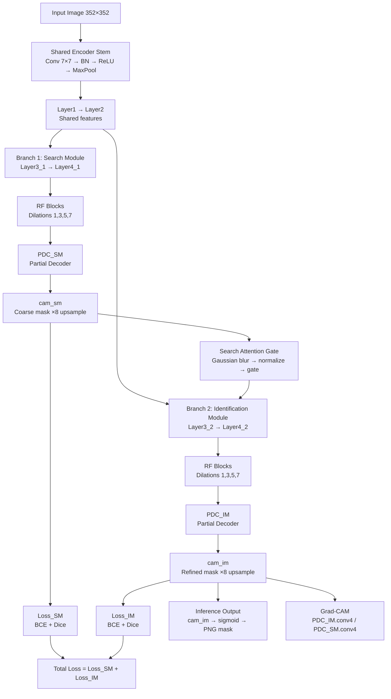

---

## Tech Stack

| Category | Tools |
|---|---|
| Language | Python 3.11 |
| Deep Learning | PyTorch 2.x, TorchVision |
| Image Processing | OpenCV, Pillow, ImageIO |
| Evaluation | py-sod-metrics (Sm, wFm, MAE) |
| Visualization | Matplotlib, Grad-CAM (custom) |
| Numerics | NumPy, SciPy |
| Progress | tqdm |
| Platform | Kaggle GPU (CUDA) |

---

## Dataset

### Sources

| Dataset | Role | Images | Reference |
|---|---|---|---|
| **COD10K-v3** | Train + Test | 6,000 train / 4,000 test | [Fan et al., CVPR 2021](https://github.com/DengPingFan/SINet-V2) |
| **CAMO-V.1.0** | Optional Train + Test | 1,250 train / 250 test | [Le et al., CVIU 2019] |
| **NC4K** | Test only | 4,121 | [Lv et al., CVPR 2021] |
| **Military Personnel Data** | Test only | 1,000 | Custom (Kaggle) |

### Expected Folder Structure

```
/kaggle/input/
├── cod10k-dataset/
│   └── COD10K-v3/
│       ├── Train/
│       │   ├── Image/          # .jpg training images
│       │   └── GT_Object/      # .png binary masks
│       └── Test/
│           ├── Image/
│           └── GT_Object/
├── camo-dataset/
│   └── CAMO-V.1.0-CVIU2019/
│       ├── Images/
│       │   ├── Train/
│       │   └── Test/
│       └── GT/
│           └── Test/
├── nc4k-dataset/
│   ├── Imgs/
│   └── GT/
└── military-personnel-dataset-dataset/
    └── CamouflageData/
        ├── img/
        └── gt/
```

### Image–Mask Pairing
Images and masks are paired by **matching filename stem** (e.g., `CAM_1.jpg` ↔ `CAM_1.png`). Pairs with mismatched spatial dimensions are discarded during dataset construction. All images are resized to **352 × 352** at train/inference time.

### Train / Val / Test Split
| Split | Source | Size |
|---|---|---|
| Train | COD10K Train (+ optionally CAMO Train) | ~6,000+ |
| Validation | Random 10% of train data (seed = 42) | ~600 |
| Test | COD10K Test, CAMO Test, NC4K, Military | 4,000 / 250 / 4,121 / 1,000 |

---

## Model and Methodology

### Architecture — SINet (Fan et al., CVPR 2020)

| Component | Details |
|---|---|
| **Backbone** | ResNet-50 (`ResNet_2Branch`) — shared stem + two independent branch paths |
| **Channel width** | 32 throughout RF and PDC blocks |
| **RF Block** | 4 parallel dilated convolutions (d = 1, 3, 5, 7) fused with 1×1 conv + residual |
| **Search Module (SM)** | Branch 1 layers → 4 RF blocks → `PDC_SM` → 1-ch coarse mask |
| **Search Attention** | Gaussian blur on `cam_sm` → min-max normalize → element-wise gate on mid features |
| **Identification Module (IM)** | Branch 2 layers (gated) → 3 RF blocks → `PDC_IM` → 1-ch refined mask |
| **Decoder (PDC)** | Progressive upsampling + multiplicative skip fusion across scales |
| **Output** | Two saliency maps: `cam_sm` (coarse) and `cam_im` (refined); inference uses `cam_im` |
| **Pretrained init** | ImageNet ResNet-50 weights mapped into both branches |

### Training Configuration

| Hyperparameter | Value |
|---|---|
| Image size | 352 × 352 |
| Epochs | 30 |
| Batch size | 12 |
| Optimizer | AdamW |
| Learning rate | 1e-4 |
| Weight decay | 1e-4 |
| LR scheduler | Step decay: `lr × 0.1^(epoch // 30)` |
| Gradient clip | 0.5 |
| Loss | BCEWithLogitsLoss + DiceLoss (on both SM and IM outputs) |
| Mixed precision | `torch.cuda.amp` (AMP enabled) |
| DataLoader workers | 4 |

### Augmentations (during training)

| Transform | Parameters |
|---|---|
| Horizontal flip | p = 0.5 |
| Random affine | Rotation ±5°, translate ±5%, scale 0.9–1.1, shear ±5° |
| ColorJitter (image only) | brightness/contrast/saturation = 0.2, hue = 0.02 |
| Normalize | ImageNet mean/std: `[0.485, 0.456, 0.406]` / `[0.229, 0.224, 0.225]` |

---

## Installation and Setup

```bash
# Clone the repository
git clone https://github.com/ishagupta0506/Camouflage-Object-Detection-System.git
cd Camouflage-Object-Detection-System

# Create and activate a virtual environment (recommended)
python -m venv venv
venv\Scripts\activate        # Windows
# source venv/bin/activate   # Linux/macOS

# Install dependencies
pip install -r requirements.txt
```

> **Note:** A CUDA-capable GPU is strongly recommended. The notebook was developed on Kaggle with a P100/T4 GPU. Ensure your PyTorch installation matches your CUDA version.

---

## How to Train

Open and run `final-project-sinet-benchmark.ipynb` in a Jupyter environment (or Kaggle).

**Key configuration flags (top of training cell):**

```python
EPOCHS       = 30
BATCH_SIZE   = 12
IMAGE_SIZE   = 352
LR           = 1e-4
USE_AUG      = True     # Enable augmentation
USE_DICE     = True     # Add Dice loss to BCE
USE_CAMO_TRAIN = False  # Set True to include CAMO training data
VAL_RATIO    = 0.10     # 10% validation split
SAVE_EPOCH   = 10       # Checkpoint save interval
```

**Update dataset paths** at the top of the data-loading cell to point to your local dataset directories before running. The best checkpoint is saved as `SINet_best.pth`.

---

## How to Run Inference

1. Place your pre-trained checkpoint (`SINet_best.pth`) in the working directory.
2. Set the test image folder path in the inference cell.
3. Run the inference cells in `final-project-sinet-benchmark.ipynb`.

The pipeline:
1. Loads `SINet_ResNet50(channel=32)` and the checkpoint
2. Resizes each image to 352 × 352 and normalizes
3. Runs forward pass → takes `cam_im` (Identification Module output)
4. Applies sigmoid → bilinear interpolation to original size → min-max normalization
5. Saves prediction as uint8 grayscale PNG

**Grad-CAM** visualizations target `PDC_SM.conv4` or `PDC_IM.conv4` and can be run for any dataset using the Grad-CAM cells in the notebook.

---

## Evaluation Metrics and Results

Metrics computed using `py_sod_metrics` and a custom `evaluate_dir()` function:

| Metric | Description |
|---|---|
| **MAE ↓** | Mean Absolute Error (pixel-level, normalized 0–1) |
| **IoU@0.5 ↑** | Intersection over Union at threshold = 128 |
| **max-Fβ ↑** | Maximum F-measure (β² = 0.3) swept across 256 thresholds |
| **Sm ↑** | Structure measure (structural similarity) |
| **wFm ↑** | Weighted F-measure |

### Benchmark Results (SINet ResNet-50 baseline)

| Dataset | Images | MAE ↓ | IoU@0.5 ↑ | max-Fβ ↑ |
|---|---|---|---|---|
| **COD10K** | 4,000 | **0.0571** | 0.2427 | **0.6933** |
| **CAMO** | 250 | **0.1442** | 0.3268 | 0.6296 |
| **NC4K** | 4,121 | **0.0932** | 0.4966 | **0.7587** |
| **Military** | 1,000 | **0.0209** | 0.3508 | 0.5217 |

> All prediction masks are included in the ZIP archives in this repository (`COD10K_predictions_zip.zip`, `NC4K.zip`, `camo_results.zip`, `military_results.zip`).

---

## Example Predictions / GradCAM Visualizations

### Predicted Segmentation Masks

These are raw binary masks produced by the Identification Module (`cam_im`) of SINet.

**CAMO Dataset**

| Sample 1 | Sample 2 |
|---|---|
| 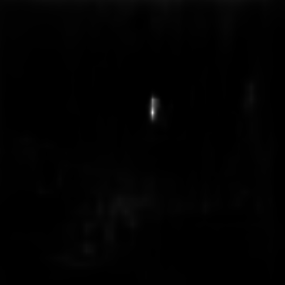 | 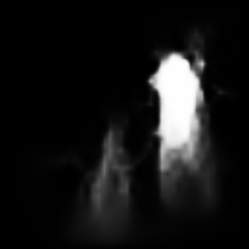 |

**COD10K Dataset**

| Octopus | Seahorse |
|---|---|
| 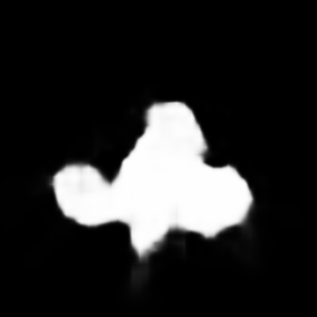 | 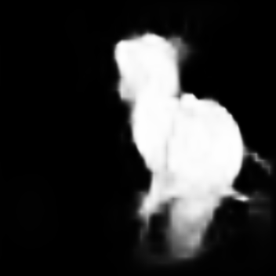 |

**Military Personnel Dataset**

| Sample 1 | Sample 2 |
|---|---|
| 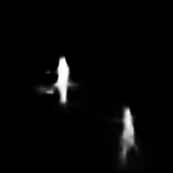 |  |

---

### Grad-CAM Visualizations

Grad-CAM overlays generated from the **Identification Module** (`PDC_IM.conv4`). Red/yellow regions indicate where the model focuses most attention to detect camouflaged objects.

**CAMO Dataset**

| Sample 1 | Sample 2 |
|---|---|
| 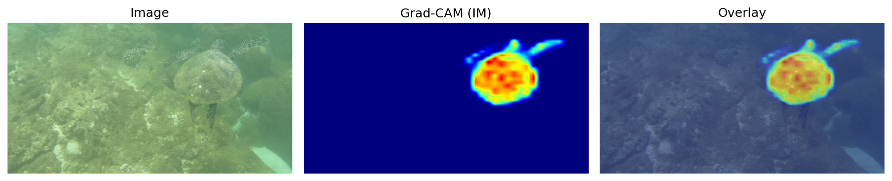 | 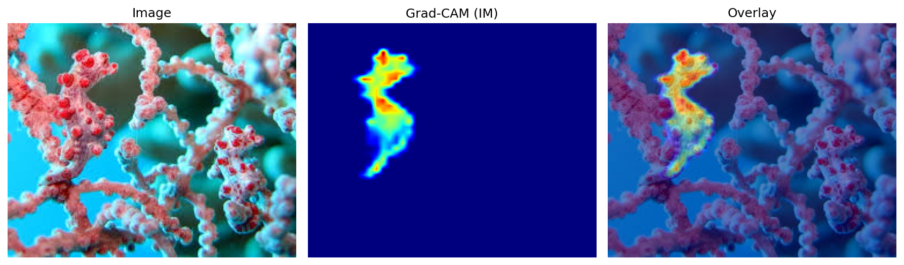 |

**NC4K Dataset**

| Sample 1 | Sample 2 |
|---|---|
| 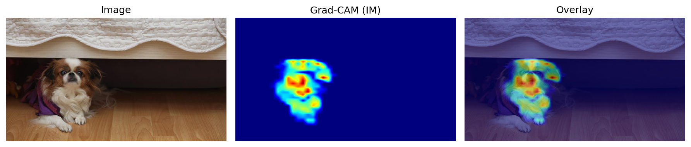 | 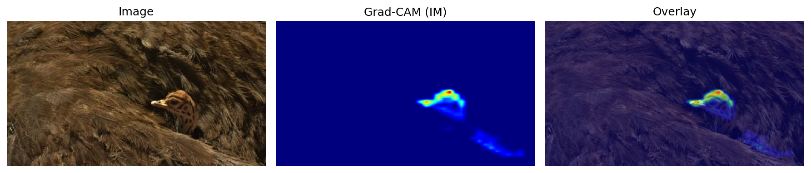 |

**Military Personnel Dataset**

| Sample 1 | Sample 2 |
|---|---|
| 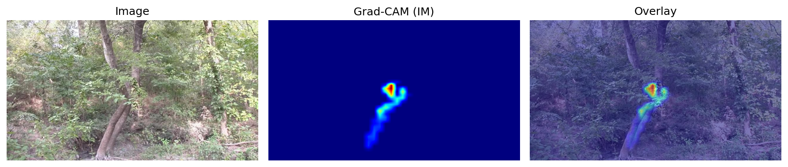 | 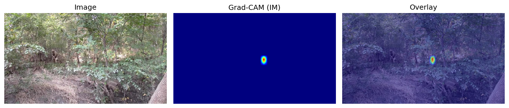 |

> Full prediction archives: `COD10K_predictions_zip.zip`, `NC4K.zip`, `camo_results.zip`, `military_results.zip`
> Full Grad-CAM archives: `GradCAM_CAMO.zip`, `GradCAM_NC4K.zip`, `GradCAM_Military.zip`

---

## Repository Structure

```
Camouflage-Object-Detection-System/
│
├── final-project-sinet-benchmark.ipynb   # Full implementation: model, training, inference, eval, Grad-CAM
│
├── requirements.txt                       # Python dependencies
├── README.md                              # This file
├── LICENSE                                # MIT License
│
├── COD10K_predictions_zip.zip             # SINet predictions on COD10K Test (4,000 masks)
├── NC4K.zip                               # SINet predictions on NC4K (4,121 masks)
├── camo_results.zip                       # SINet predictions on CAMO Test (250 masks)
├── military_results.zip                   # SINet predictions on Military dataset (1,000 masks)
│
├── GradCAM_CAMO.zip                       # Grad-CAM overlays — CAMO (16 images)
├── GradCAM_NC4K.zip                       # Grad-CAM overlays — NC4K (16 images)
└── GradCAM_Military.zip                   # Grad-CAM overlays — Military (16 images)
```

> **Note:** Model weights (`SINet_best.pth`) and raw datasets are not included — they are accessed via Kaggle input paths during notebook execution.

---

## Limitations and Possible Improvements

| Limitation | Possible Improvement |
|---|---|
| All code in a single monolithic notebook | Refactor into modular `train.py`, `test.py`, `models/`, `datasets/` |
| No model weights in repo | Upload checkpoint to Hugging Face Hub or GitHub Releases |
| IoU@0.5 is low (0.24 on COD10K) | Fine-tune longer, explore SINet-V2 or transformer-based backbones (e.g., Swin) |
| CAMO evaluation included train-split GT | Fix CAMO test path to use only Test GT folder |
| No learning curve plots stored | Add TensorBoard / W&B logging during training |
| Hard-coded Kaggle input paths | Parameterize via config file (`config.yaml`) or CLI args |
| Single backbone (ResNet-50) | Experiment with ResNet-101, EfficientNet, or ViT backbones |
| No test-time augmentation (TTA) | Ensemble predictions with horizontal flips / multi-scale |

---

## Credits and References

This implementation is based on the **SINet** architecture:

> **Fan, D-P., Ji, G-P., Sun, G., Cheng, M-M., Shen, J., Shao, L.** *Camouflaged Object Detection.* CVPR 2020.
> [Paper](https://openaccess.thecvf.com/content_CVPR_2020/papers/Fan_Camouflaged_Object_Detection_CVPR_2020_paper.pdf) | [Official Code](https://github.com/DengPingFan/SINet/)

**Datasets:**
- **COD10K-v3** — Fan et al., TPAMI 2021
- **CAMO** — Le et al., Computer Vision and Image Understanding (CVIU) 2019
- **NC4K** — Lv et al., CVPR 2021

**Base notebook reference:**
- [Camouflage Detection by ManthanKPatel](https://github.com/ManthanKPatel/Camouflage-Detection/blob/main/DLProject.ipynb)

**Evaluation library:**
- [`py_sod_metrics`](https://github.com/lartpang/PySODMetrics) — Yunchao Liang

---

## License

This project is licensed under the **MIT License** — see the [LICENSE](LICENSE) file for details.
